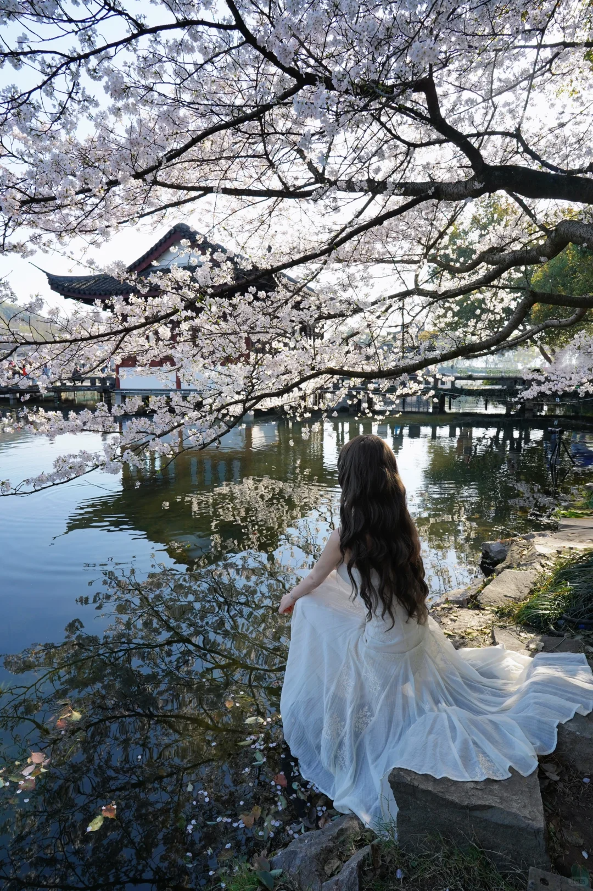
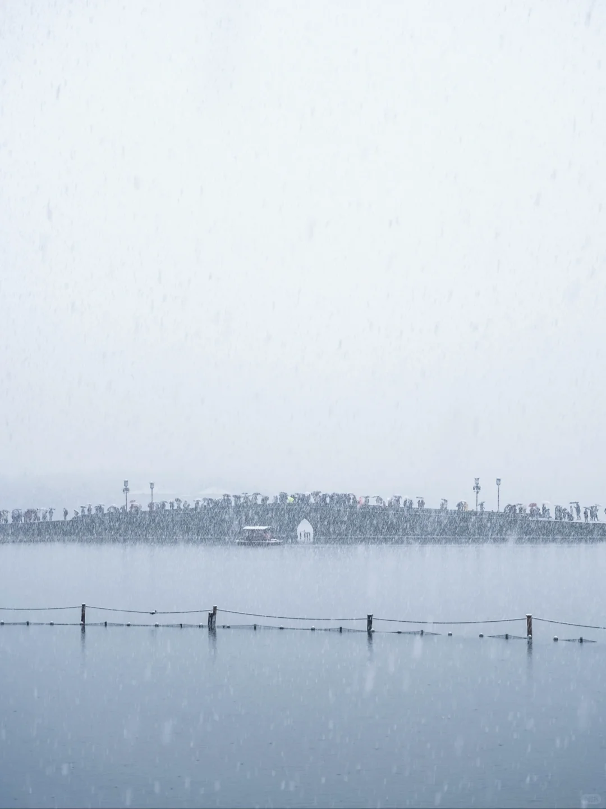
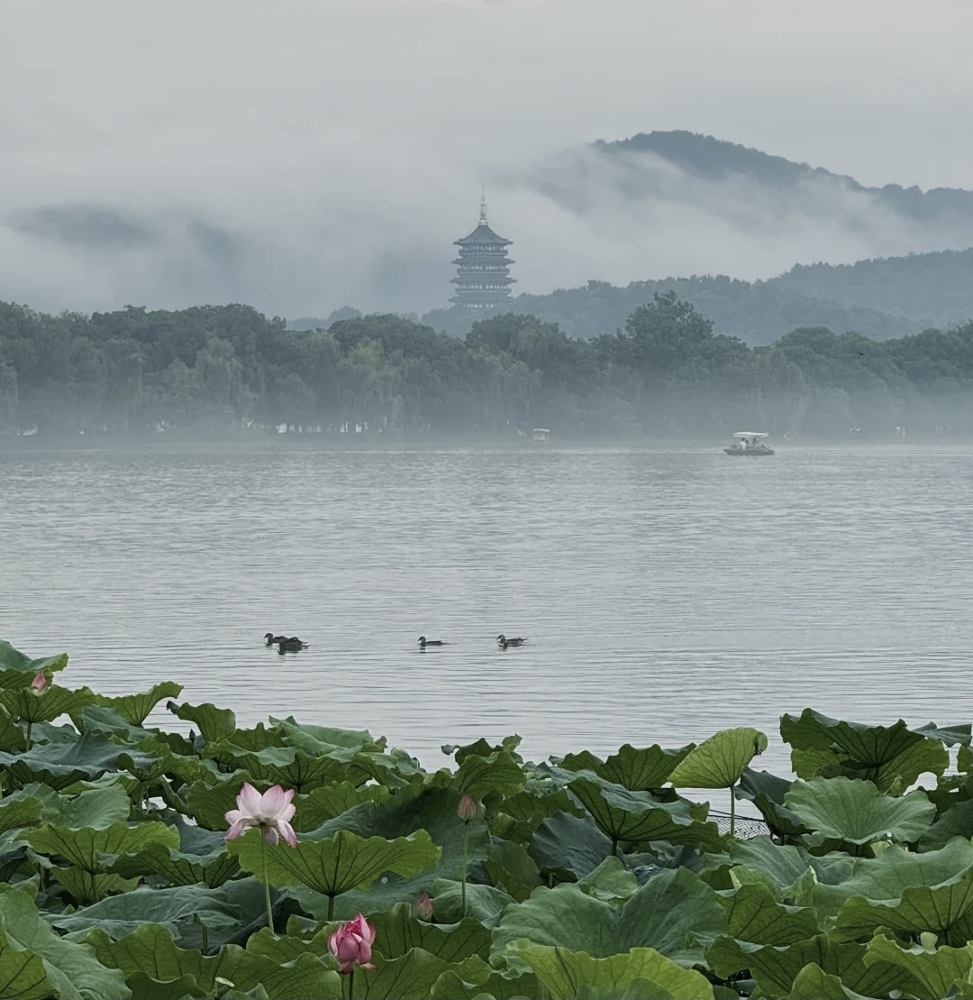
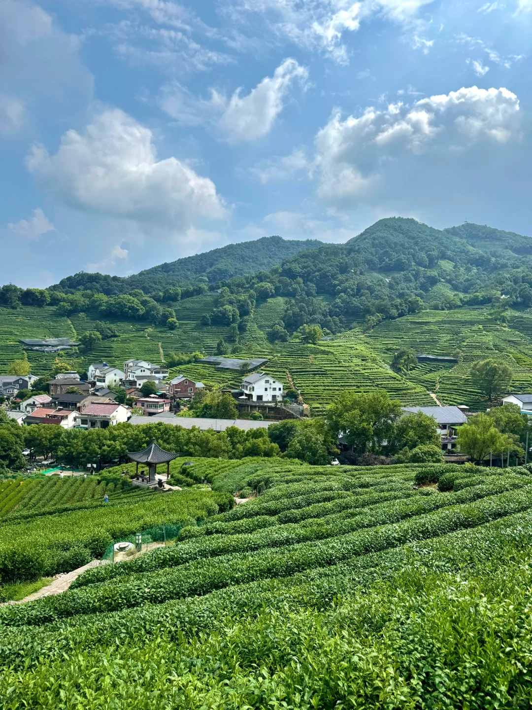
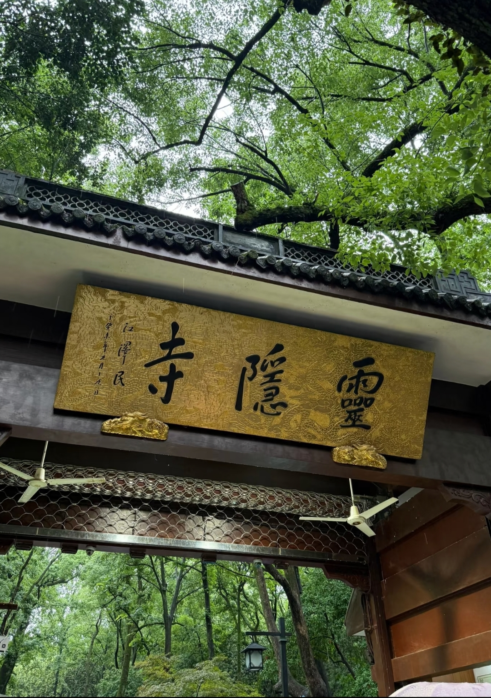
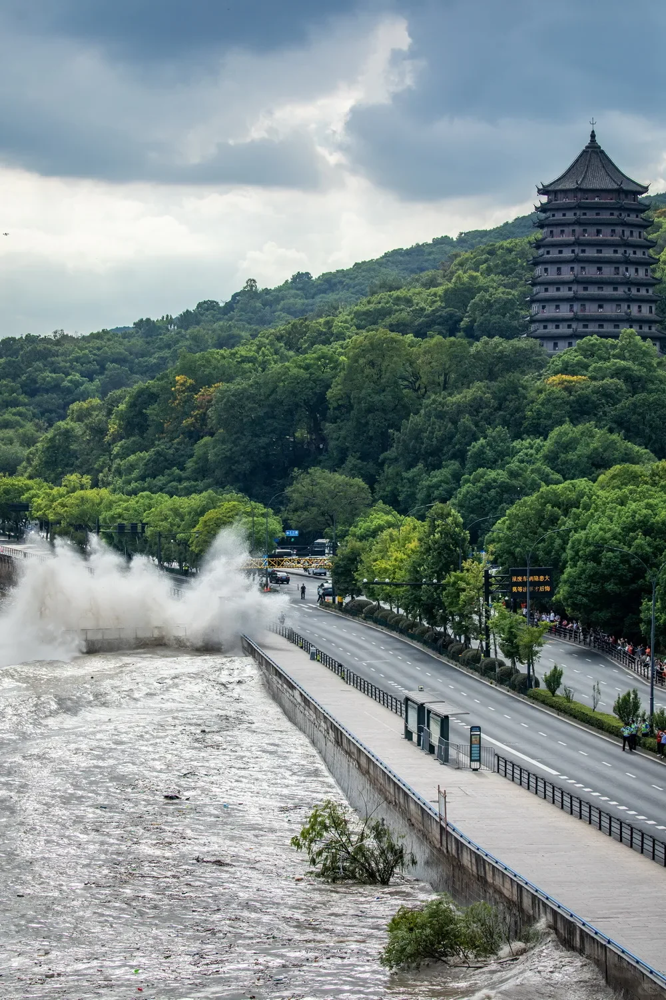

# 杭州

> 西子湖畔莫归客，醉看花下赏花人。

---

## 西湖春行

> 恰逢江南又仲春，春风桃花满杭城。
> 西子湖畔莫归客，醉看花下赏花人。

———丙午年·春·魏东坡

### 赏析

气韵天成，如一幅流动的江南春画卷。

**起兴自然，有"邂逅"之趣**——"恰逢"二字立定全诗气韵，暗含不期而遇的欣然，顿生《诗经》"邂逅相遇，适我愿兮"的古典情致。"江南"，白居易诗里的"江南好，风景旧曾谙"。"又仲春"，一"又"字绾合永恒与刹那，既有"岁岁年年花相似"的轮回之思，亦藏晏殊"似曾相识燕归来"的微妙怅惘。

**意象并置，见唐人气象**——"春风桃花"四字，乃盛唐绝句经典语汇。更妙在"满杭城"三字破空而来，将王涯"满园春色"之庭院视角，升华为杜牧"千里莺啼"的城郭尺度，令画面顿生旷远之境。

**用典无痕，暗渡西子灵韵**——"西子湖畔"四字，轻点东坡"欲把西湖比西子"之典，然不着斧痕。"莫归"二字如琴弦乍裂，打破古典诗"日暮客愁新"的哀婉定式。不写游子思归，反作山水劝留，与《楚辞·招隐士》"王孙兮归来，山中兮不可久留"形成奇妙对仗。

**观照之妙，得庄禅真谛**——"醉看"非仅酒态，实乃"万物静观皆自得"的审美沉醉，暗合庄子"身与物化"之境。昔有陶渊明"悠然见南山"的静观，此则进乎"看人看花"的动观——诗人既在花外交融物我，复在境中反观自照。"赏花人"为大众游春的日常诗意，尤妙在"醉"字将欧阳修"醉翁之意不在酒"的文人意趣，化作对世俗欢愉的注视。

---

## 江南烟雨

> 青衫黛影烟雨寒，朝暮花落摇橹船。
> 知君故里春不晚，此身归隐去江南。

———乙巳年·春·魏书

### 赏析

《江南烟雨》是一幅浸润着水墨诗魂的归隐长卷，在烟雨迷离中写出古典意象，实现对江南美学的创造性转化。

**色彩叙事：青黛晕染的视觉通感**——开篇「青衫黛影烟雨寒」如吴冠中笔下的水墨江南：以「青衫」勾连白居易《琵琶行》"江州司马青衫湿"的文人底色，"黛影"可指远山的青色轮廓，亦可暗喻女子朦胧的倩影。冷色调的「青」「黛」与「烟雨寒」的氤氲水气相融，形成视觉的温度差，较之韦庄《菩萨蛮》"春水碧于天"的单纯色相描摹，更添「墨分五色」的层次纵深。

**时空折叠：摇橹声里的古今对话**——「朝暮花落摇橹船」自然现象暗示年华易逝，朝暮之间重构江南时序：晨昏交替的花落动态与永恒循环的摇橹节律并置，暗藏张继《枫桥夜泊》"月落乌啼霜满天"的时空压缩技巧。

**归隐新诠：春不晚的精神归隐**——"知君故里春不晚"巧妙化用南朝陆凯《赠范晔诗》中"江南无所有，聊赠一枝春"及杜甫"正是江南好风景，落花时节又逢君"的唯美意境。虽言"故里春不晚"，实际表达的是无论何时，心中那片江南永远如初春般美好温暖，正如每个北方人心怀一个烟雨江南。"此身归隐去江南"以最直接的陈述，表达了对江南这片象征超脱、诗意生活的土地深深的眷恋和归宿感。

此诗堪称当代旧体诗新古典主义的典范：既在「青衫/黛影」「花落/摇橹」的对仗中恪守近体诗法度，又以「知君故里」的私语化表达打破传统咏物诗的抒情距离。魏东坡的江南，不再是文人寄怀的客体，而成为主体精神归隐的世外桃源。

---

## 西湖踏春

> 青山归隐泛云舟，闲时江南春日游。
> 偕行小桥流水间，满头杏花共白首。

———壬寅年·春·魏书

### 赏析

整首诗如同徐徐展开的一幅春日西湖水墨画。

首句"青山归隐泛云舟"起笔即大气磅礴。"青山归隐"四字赋予青山以隐逸者的神韵，仿佛连绵的山峦是远离尘嚣的隐士，静静守护着西湖。而"泛云舟"则极具画面感和飘逸感——舟行水上，倒影婆娑，水天一色，轻舟仿佛漂浮在云雾之中。

次句"闲时江南春日游"点明主题（踏春）、地点（江南）、时间（春日）与心境（闲时）。"闲时"二字尤为关键，这不仅指时间的宽裕，更暗合传统文人"偷得浮生半日闲"的雅趣和追求心灵自由、与自然相融的处世理想。

第三句"偕行小桥流水间"将镜头拉近，展现典型的江南水乡景致。"小桥流水"是古典诗词中表达江南风物的经典意象组合（如"小桥流水人家"），瞬间勾勒出婉约、清丽、宁静的局部画卷。"偕行"则引入了人的活动，暗示着与一生相伴之人共同游赏的雅事。

结句"满头杏花共白首"意境升华，最为精妙传神，"共白首"是全诗的灵魂所在——实景描绘出春日杏花如雪的烂漫盛景，更深层的意思是暗示与人生伴侣一同漫步在春光里，从黑发携手到白发苍苍，共度一生。一个"共"字，将踏春之乐升华为相伴终老、地老天荒的深沉情意。以瞬时的自然物象，寓托了绵长的人生情感和时间感，极具艺术张力。

---

## 西湖·曲院风荷

> 江南怜得半日闲，浮云行舟入画卷。
> 稚子采荷鱼戏水，醉翁酒落湿衫前。

———壬寅年·夏·魏书

### 赏析

全诗是一轴浸透宋元逸气的江南消夏图，以四句清墨，将西湖荷韵谱成永不褪色的水墨琴音。

首句"江南怜得半日闲"以"闲"字定调，暗合南宋陆游"矮纸斜行闲作草"的文人雅趣，将曲院风荷的游览升华为超脱尘务的精神体验。次句"浮云行舟入画卷"巧妙呼应董邦达《西湖十景册》的实景绘画传统，以"浮云"之动、"行舟"之缓，构建移步换景的山水长卷意象。

"稚子采荷鱼戏水"化用陈璨"木兰舟上如花女，采得莲房爱子多"的采莲场景，以稚子嬉荷、鱼群相戏的动态细节，暗写荷塘生态之丰茂。

尾句「醉翁酒落湿衫前」承袭欧阳修《醉翁亭记》的放达气韵：青衫酒渍晕染如石涛「拖泥带水皴」，襟前水痕暗藏怀素《自叙帖》的狂草笔势。这「湿」字既含李白「天子呼来不上船」的疏狂，又带张旭「脱帽露顶王公前」的酣畅，更似苏轼「一蓑烟雨任平生」的旷达衣纹。

诗中"稚子"与"醉翁"的意象并置，形成生命轮回的哲学隐喻。全诗既延续了厉声教"芙蓉出水连天远，西子多娇"《采桑子》的雅词血脉，更以"酒落湿衫前"的生活化细节，赋予古典意象现代温度。

---

## 西湖夕照

> 雷峰金霞映江南，暮色烟岚夕照山。
> 曲院风荷红似火，泊舟行云水在天。

———甲辰年·夏·魏书

### 赏析

这首《西湖夕照》以凝练的笔触勾勒出江南夏日暮色中的诗意画卷。

"雷峰金霞映江南"以雷峰塔为核心意象，金色霞光为自然晕染，瞬间构建出西湖标志性景观。雷峰塔在传统文化中承载着白蛇传说的浪漫底蕴，而"金霞"的鎏金色调呼应了佛教圣地的辉煌感，使自然景观与人文传说交融。暮色中的塔影与霞光，暗合王勃"落霞与孤鹜齐飞"的壮美意境，却更显江南的温婉。

"曲院风荷红似火"化用白居易"日出江花红胜火"，以"火"喻荷，既是视觉夸张，亦暗含生命律动。杨万里"接天莲叶无穷碧"写荷之绵延，此处"红似火"则突出夕照下荷花的炽烈感，赋予静景以动态张力。

末句"泊舟行云水在天"以水天互映制造视觉幻境：行云本在天，却因水面倒影形成"云在水中"的错觉；而"泊舟"作为实体打破虚像，形成虚实咬合的辩证关系。此手法暗合庄子"天地与我并生"的物化观，亦呼应张先"云破月来花弄影"的朦胧美学。

泊舟在古典诗歌中常象征精神归宿，此处舟泊云水间，既是对西湖渔隐传统的致敬，亦暗喻诗人暂离尘嚣、融入天地的超然心境。全诗浓缩了西湖的物理景观与人文精魂，既是苏轼"欲把西湖比西子"的千年回响，又以"火"之热烈、"云"之流动注入现代生命感悟。

---

## 西湖秋鉴

> 苏堤东坡西湖秋，莲叶深处泛云舟。
> 闲吟宋词茶醉酒，落尽风尘已忘忧。

———癸卯年·秋·魏书

### 赏析

这首诗以苏堤秋色为轴，融景入情，承袭宋韵，在简淡笔墨中勾勒出文人超然尘外的精神图景。

首句以"苏堤东坡"双关入题，既实指西湖苏堤秋景，又暗合苏轼疏浚西湖、筑堤惠民的历史功绩。"秋"字点明时令，更呼应苏轼"水光潋滟晴方好"的审美意境，将自然景观与人文记忆融为立体画卷。

"莲叶"化用乐府"江南可采莲"的古典意象，而"云舟"一词尤为精妙：舟行莲荡如浮云海，既写实景之缥缈，又隐喻超脱之志（《庄子·列御寇》"泛若不系之舟"）。

"闲吟宋词茶醉酒"——"宋词"直溯西湖文脉；"茶酒"并提则暗含双重文化符号：茶道之清雅（陆羽《茶经》"精行俭德"）与酒神之狂放（李白"斗酒诗百篇"）。二者交融，恰似纳兰容若"赌书消得泼茶香"的文人闲趣，更呼应苏轼"且将新火试新茶"的生命豁达。

"落尽风尘已忘忧"——"风尘"既指旅途劳顿（陶渊明"误落尘网中"），亦喻世务纷扰；"忘忧"典出《诗经·卫风》"驾言出游，以写我忧"，而"落尽"二字以叶落归根之态，暗合范仲淹"不以物喜，不以己悲"的忧乐圆融。此诗如一枚精巧的宋瓷片：苏堤为胎，宋词作釉，茶酒点彩，终在"忘忧"的窑火中淬炼出千年文人的精神釉色。

---

## 西湖

> 苏堤东坡西湖秋，莲叶深处泛云舟。
> 闲吟宋词茶醉酒，落尽风尘已忘忧。

———癸卯年·秋·魏书

### 赏析

此诗与《西湖秋鉴》为姊妹篇，同以苏堤秋色为背景。"苏堤东坡西湖秋"七字蕴含三重意蕴——地名（苏堤）、人名（东坡）、湖名（西湖），一道秋景串联千年文脉。"落尽风尘已忘忧"是诗眼所在，表达了在西湖山水间洗涤尘心、抵达忘忧之境的精神体验。全诗承袭了苏轼"欲把西湖比西子"的审美传统，又在"茶醉酒"的微醺中融入了当代人的心灵寄托。

---

## 西湖雪

> 沽酒垆前横孤舟，江南寒冬又重游。
> 西子湖畔同淋雪，今生与卿共白头。

———庚子年·冬·魏书

### 赏析

《西湖雪》是一阕融古典意象与现代情愫的白头之约，魏东坡以雪为媒、以湖为砚，在西湖的素笺上写下穿越时空的温柔契约。

首句"沽酒垆前横孤舟"以"沽酒"暗藏司马相如《凤求凰》"当垆沽酒"的典故旧影，又以"横"字续写柳宗元《江雪》"孤舟蓑笠翁"的寂寥意境。但此处「孤舟」非独钓寒江的出世符号，而成为等待的物证——舟横酒垆的静默，恰似张岱《湖心亭看雪》"惟长堤一痕"的留白，为"重游"埋下时空伏笔。

"江南寒冬又重游"中"又"字将白居易《忆江南》的追忆情致转化为江南重逢，寒潮裹挟的记忆碎片在湖面渐次显影。

"西子湖畔同淋雪"化用苏轼"欲把西湖比西子"的经典喻象，却将"淡妆浓抹"的视觉美学升华为触觉体验。表层嫁接纳兰性德《采桑子》"非关癖爱轻模样，冷处偏佳"的冰雪情结，深层则激活当代"他朝若是同淋雪，此生也算共白头"的网络诗语，古今结合。末句"今生与卿共白头"以雪色置换青丝，延续汉乐府"冬雷震震夏雨雪，乃敢与君绝"的炽烈。

全诗押ou韵（舟、游、头），闭口音与开口音交替，如雪落湖面时细密的涟漪。魏东坡用四句诗搭建起一座虚实相生的断桥，桥这边是"垆前孤舟"的唐诗宋韵，桥那头是"与卿白头"的现代誓言。

---

## 蝶恋花·西湖

> 中庭碧树倚西墙，渔舟轻摆，暗渡旧韶光。暮色青山天边隐，不羁流云笑轻狂。
>
> 携行小桥画船舫，素手鲛绡，拭尽红尘殇。伴君看尽江南色，功名利禄是寻常。

———丙申年·秋·魏书

### 赏析

《蝶恋花》作为唐宋经典词牌，音韵流转如西湖水波，贴合词牌婉约特质。

"渔舟轻摆，暗渡旧韶光"化用苏轼"绿水人家绕"之景，以淡墨勾勒西湖暮色，碧树倚墙显静谧，延续柳永"杨柳岸晓风残月"的时空凝练感，将流逝感藏于轻舟动态中。"不羁流云笑轻狂"——"狂傲不羁"是文人的传统，从李白"仰天大笑出门去"到朱敦儒"几曾着眼看侯王"，都体现了对功名的蔑视，与结尾"功名利禄是寻常"形成哲学呼应。

"素手鲛绡，拭尽红尘殇"："鲛绡"（传说鲛人泪所织之纱），将泪痕升华为对尘世的主动超脱，较之欧阳修"凭君剩把芳尊倒"的借酒消愁更显彻悟。"伴君看尽江南色"：双人游赏之景，呼应柳永"执手相看泪眼"，却以"看尽"显豁达，跳脱离愁别绪，突破晏几道"落花人独立"的孤寂，建构双人共游的温暖画面。

结句"功名利禄是寻常"，化用纳兰容若"当时只道是寻常"，有赵孟頫"功名纸半张"的淡泊，直抒超然物外之怀。此境暗合欧阳修"老去风情应不到，凭君剩把芳尊倒"的晚岁豁达，更以"寻常"二字将仕途荣辱归于平淡，暗合范仲淹"不以物喜，不以己悲"的士大夫精神。

此词以西湖为卷，以渔舟为笔，融暮霭流云为墨色，绘出一幅"淡妆浓抹总相宜"的文人写意画。其景承宋人清雅，其情汇魏晋风骨，其思通老庄玄理，实为对宋明雅词传统的当代致敬。

---

## 忆西子

> 西泠湖畔断桥东，泛尽孤舟倚乌蓬。
> 如画水墨起烟雨，沾衣未觉江南梦。

———丙申年·春·魏书

### 赏析

《忆西子》如一幅氤氲着千年文脉的江南水墨卷轴，在二十八字的方寸间晕染出超越时空的西湖诗境。

首句"西泠湖畔断桥东"打破物理空间的线性逻辑，将西泠印社的文雅、白堤断桥的传奇、欲把西湖比西子的三重文化坐标熔铸于同一平面，使西湖不再是地理概念，而升华为承载集体记忆的文化符号。

"泛尽孤舟倚乌蓬"七字如青铜编钟，在历史长河中敲响跨越千年的文化共振。苏轼笔下的"驾一叶之扁舟"（《赤壁赋》）是解构天地宏大的认知装置，其孤舟承载着"寄蜉蝣于天地"的宇宙意识。当现代诗人的桂花酒与东坡的洞箫声在舱内共鸣，乌篷船便成为容纳儒道释思想碰撞的谐振腔。"泛尽"二字暗藏诗学革命：不同于传统渔隐文化中"钓罢归来不系船"的闲适，现代泛舟者历经存在主义式的精神远航。

"倚"字创造精妙的时空接口：诗人斜倚的不仅是船舷，更是中国诗歌史的千年堤岸。既有太白"散发弄扁舟"的疏狂余震，也蓄积着对抗现代性孤独的精神势能。

"沾衣未觉江南梦"——"沾"字取法《楚辞》"霑余襟之浪浪"，"衣"字承《诗经》"岂曰无衣"之象，以微物见大千。更妙在"未觉"，似从陶潜"欲辨已忘言"处悟得，将《坛经》"本来无一物"之禅机，藏于烟雨空濛间。当西湖烟雨浸透的不再是绢本设色的古典画卷，而是现时代的精神孤独，孤舟上的现代诗人与北宋文豪的对话，便成为修复文化记忆的诗性艺术。

---

## 西湖·茶偈

> 麝香寒窗凝尘榻，松涛银霜冷月华。
> 酌酒金樽醺诗梦，醉倾风露初烹茶。

———戊戌年·夏·魏书

### 赏析

寥寥数笔勾勒出一幅古意盎然、超逸绝尘的画卷，并从品茗这一雅事中感悟生活的哲思与超脱的情怀。

寒窗、凝尘榻、银霜、冷月华：开篇即以一组冷色调、高洁孤寒的意象奠定基调。"麝香寒窗"暗示深居简出，"凝尘榻"既写实又写意（心境的澄澈与寂静）。松涛阵阵，银霜覆地，月华冷艳，共同营造出一种远离世俗喧嚣、澄澈空灵的意境。这些意象虽"冷"，却非死寂，而是流动着生命的静气（如松涛声、流淌的月光），深合古典审美中"幽寂"、"清冷"之美。

"酌酒金樽醺诗梦"延续了古典文士"诗酒风流"的传统，李白"斗酒诗百篇"是其典范。"醉倾风露初烹茶"——诗人并未沉溺于酒醉，而是巧妙地转向更清雅、更富哲思的饮茶。"醉倾风露"写醉后姿态的放达不羁，"初烹茶"则突然一转，隔空对话苏轼"且将新火试新茶，诗酒趁年华"。

从"酌酒"到"初烹茶"的转变暗含了古典生活哲学：即能在放纵中收束，在沉醉后澄明，达到一种圆融自在的境界。全诗一幅意境高古的文人生活小像，一首流淌着传统情韵的茶之赞歌。它承袭了古典诗歌追求清冷、孤高、雅逸的境界营造，巧妙融合了诗酒风流与茶道精神。

---

## 西溪·暮秋

> 火柿糕酥桂花酒，一曲烟葭十里洲。
> 江南摇橹青荇度，秋芦飞雪满白头。

———壬寅年·秋·魏书

### 赏析

首句"火柿糕酥桂花酒"连用四个名词意象，这是典型的列锦手法，暗合马致远"枯藤老树昏鸦"的经典范式。"火柿"、"糕酥"、"桂花酒"组成的意象群，构建了温馨甜蜜、物产丰饶的初秋晚秋氛围。

次句"一曲烟葭十里洲"——"烟葭"意象空灵，指向《诗经·秦风·蒹葭》的经典意象："蒹葭苍苍，白露为霜。所谓伊人，在水一方。"诗人在西溪暮霭中看到"烟葭"，潜意识里已引入了一重追寻与企慕的情感底色。

转句"江南摇橹青荇度"中的"青荇"，源出《诗经·周南·关雎》："参差荇菜，左右流之。窈窕淑女，寤寐求之。"荇菜是《关雎》君子追求淑女时采摘的水草，是爱情萌芽的象征。

结句"秋芦飞雪满白头"收束全诗，意境升华，如镜头陡然拉升，芦花漫舞的苍茫中，自然之雪与人生白发浑然相融。"满白头"一语双关：漫天飞舞的芦花为爱人提前"染就"了象征永恒之爱的"白首"，是忠贞的象征而非衰老的悲叹，这是对"与子偕老"誓言的诗意呈现和自然加持。

全诗成功化用了《诗经》中多个核心的爱情意象（蒹葭、青荇），并赋予"飞雪白头"这一新组合以经典爱情的象征意义（偕老、永恒）。全诗通篇未着一个"情"字，却通过精心构建的意象群落，情景交融，意境浑成。

---

## 西溪·初秋

> 御临雪酥古糖坊，一夕秋水渡荷塘。
> 青丝绾结舟未见，归隐尘心饮茶汤。

———癸卯年·秋·魏书

### 赏析

首句"御临雪酥古糖坊"将宫廷御点（雪酥）与民间作坊（糖坊）并置，既暗藏历史纵深，又点出西溪"河渚街"市井文化脉络。糖坊的甘美与秋水的清冽形成味觉通感，延续王维"诗中有画，画中有味"的古典美学传统。

次句"一夕秋水渡荷塘"化静为动，秋水非止于观，更可"渡"之，将西溪湿地的潋滟波光凝练为哲学意象，较之张岱《湖心亭看雪》更多三分从容禅意。

转句"青丝绾结舟未见"化用"青丝绾君心"典故（典出唐代晁采《子夜歌》"觅向无人处，绾作同心结"），以女子束发动作暗喻情定终身。在"绾结"与"未见"的辩证中，既承《楚辞》"结桂枝兮延伫"的执着，又启现代爱情"等待即在场"的哲思。

结句"归隐尘心饮茶汤"如云开月现，"归隐尘心"化用佛家"除尘念"理念，与西溪自古为隐逸圣地的历史相契。青丝为茧，情思作芯；舟影未至，心舟已渡。而秋水茫茫处，舟影成空，唯余茶烟袅袅，升腾成一句禅偈——原来最深的红尘，不在眼底，在望穿秋水的眸中。

---

## 西溪洪园

> 洪氏宗祠长生殿，钱塘望族八百年。
> 清平山堂刻书坊，闲来煮茶流水间。

———乙巳年·冬·魏书

### 赏析

此诗以杭州西溪洪园为吟咏对象，前两句写洪氏家族的历史渊源——"钱塘望族八百年"点出洪氏自宋代以来绵延八百年的文脉。后两句转入当下的闲适意境——"清平山堂"是明代洪楩的刻书坊名号，"闲来煮茶流水间"将书香门第的雅致与江南园林的清幽融为一体，展现了传统文化在当代生活中的延续。

---

## 满觉陇·桂花

> 西风知意吹梦走，回首江南已是秋。
> 满陇桂雨闲庭落，南麓清寒上心头。

———壬寅年·秋·魏书

### 赏析

"满觉陇"是杭州西湖著名赏桂胜地，地名自带诗意与文化积淀，使人立刻联想到新西湖十景"满陇桂雨"。诗人选取此地为题，继承了古典诗词中"特定地点承载特定情感"的传统（如"姑苏城外寒山寺"）。

"西风知意吹梦走"此句开篇不凡，极具灵性，化用"南风知我意，吹梦到西洲"，运用拟人手法（"知意"），赋予西风以人格和情愫。"西风"是传统秋日的象征意象（如"昨夜西风凋碧树"），在此不仅带来气候变迁，更似有情感地引导或催动着诗人的思绪与幻梦（"吹梦走"）。化抽象之"梦"为可吹之愁，想象力奇崛，笔法空灵流转。

"回首江南已是秋"一个"回首"，如镜头横摇，在转身的刹那完成时空折叠，极简地完成了从"梦境"到"现实"，从"意念"到"江南"的时间和空间跳跃。"已是秋"三字将前句隐含的秋意猛然坐实，充满时间的流逝感和季节变化的猝然性。"已"字如暮鼓惊心，将岁月倥偬的顿悟化为桂子落肩的轻叹。

"满陇桂雨闲庭落"堪称诗眼，以"桂雨"重构自然奇观：金粟纷扬不是凋零的挽歌，而是天地馈赠的鎏金请柬。动词"落"字承托千钧，既写花雨翩跹之形，更传心绪澄明之态，与王维"人闲桂花落"形成古今对望，却因"满陇"的浩荡气象更显磅礴静美。

"南麓清寒上心头"此句收束全诗，韵味深远。"清寒"二字精准刻画秋意已深时山间的微冷感受，是典型的触觉意象。妙在"上心头"：将外在山麓清寒自然过渡、升华为内在的思绪之"寒"。这"寒"不仅仅是身体的寒意，更是秋意撩动心弦所生的那份感慨、回忆、甚至寂寥，契合古典诗学"一切景语皆情语"。

---

## 西湖龙井

> 九溪烟树行人满，龙井采茶春竹盘。
> 倦归坐看云深处，江南余味是清欢。

———壬寅年·春·魏书

### 赏析

此诗以简洁明快的笔触，勾勒出一幅生动的西湖春日龙井茶事图，融自然之景、人文之趣与心境之悟于一体。

首句"九溪烟树行人满"如青绿山水开卷，烟岚萦绕的溪涧与摩肩接踵的茶客，用"烟树"二字生动描绘了江南春日水汽氤氲、林木苍翠如被轻烟笼罩的典型景致。"行人满"则从侧面烘托出龙井茶区的盛名和春日采茶季的熙攘景象。

次句"龙井采茶春竹盘"——"龙井采茶"点明所盛为清明谷雨时节的春日茶青。"春竹盘"巧妙化用苏轼"雪沫乳花浮午盏，蓼茸蒿笋试春盘"，与苏东坡跨越时空深刻对话，是古典诗词中"春盘"意象在茶文化语境下的精彩创新转化。

转句"倦归坐看云深处"如焦墨点染，采茶人的倦意非为劳顿，恰是陶然忘机的注脚。"云深处"三字既写狮峰山巅的实景，又将诗的意境陡然拔高，从现实的茶事活动转向心灵的远眺与哲思，如王维"行到水穷处，坐看云起时"的禅意。

结句"江南余味是清欢"如茶汤回甘，不着痕迹化用苏轼"人间有味是清欢"，却以"余味"替代"有味"，于江南春日品龙井之后所体味的最高精神愉悦，将日常的茶事活动升华为一种具有东方哲学意味的生活美学追求。这"江南余味"，不只是一盏茶的滋味，更是千年江南文脉所积淀的生活艺术与生命哲学在诗行间的回荡。

---

## 西溪探梅

> 十里曲水闲寻梅，江南三月满芳菲。
> 西溪花雪渡香陌，凌波横塘醉春归。

———癸卯年·春·魏书

### 赏析

"西溪探梅"作为江南文人的经典审美，早在清代便位列"钱塘十八景"。诗中"十里曲水"暗合《西湖志》所载"西溪河道迂回十里有奇，梅树夹岸"的景致，而"闲寻梅"的"闲"字，既呼应了宋代杨万里"从此朝朝暮暮来"的痴迷，更承袭了范仲淹"萧条腊后复春前，雪压霜欺未放妍"的寻梅雅趣。

首句"十里曲水闲寻梅"起笔从容，"十里"丈量西溪湿地的空间纵深，"曲水"应和《兰亭集序》的千古文脉。次句"江南三月满芳菲"如青绿泼彩，以"满"字统摄天地生机，较之白居易"乱花渐欲迷人眼"的纷繁，此处更显春意饱和的丰盈。

转句"西溪花雪渡香陌"最见匠心，"花雪"二字兼得梅之皎洁与春之烂漫，以视觉通感写香气的氤氲流转。"渡"字尤妙，既写花瓣随水漂游之态，又传暗香沁透小径之神，较之林逋"暗香浮动月黄昏"的孤寂，此句更多三分人花相悦的灵动。

结句"凌波横塘醉春归"，"凌波"化用曹植《洛神赋》"凌波微步，罗袜生尘"，赋予春归以仙子涉水的轻盈灵动。"横塘"是古典诗词中经典的江南水域意象（如贺铸"凌波不过横塘路"），与"凌波"呼应。诗人以曲水为经、花雪为纬，在凌波微步间织就一幅流动的江南春梅图。

---

## 秋霁

> 苕溪荻雪漫一州，烟水汀畔蓼花秋。
> 暮晚渔舟江南渡，风吹芦花又白头。

———乙巳年·秋·魏书

### 赏析

"苕溪荻雪""芦花白头"化用江南秋景经典意象。荻与芦在古典诗中常构成秋日苍茫底色，如白居易《琵琶行》"枫叶荻花秋瑟瑟"，刘禹锡《晚泊牛渚》"芦苇晚风起，秋江鳞甲生"。诗中"漫一州"以泼墨笔法展开浩渺画卷，承袭了谢朓"澄江静如练"的江南空间美学。

"暮晚渔舟"暗含日暮归舟的经典范式，呼应王勃"渔舟唱晚，响穷彭蠡之滨"的时空意境。而"江南渡"三字点出渡口意象，在唐诗中常为羁旅愁思载体，此处却以静谧消解孤寂，凸显隐逸之乐。

"烟水汀畔蓼花秋"以朦胧雾气弥合天水分界，构建中式留白。蓼花缀于水岸，红艳点染青灰主调，恰如马远《寒江独钓图》以孤舟统摄虚空。这种"雾失楼台，月迷津渡"的造境手法，展现文人画"计白当黑"的审美哲学。

"风吹芦花又白头"兼具视听通感：风动荻浪如雪涌，声似秋潮暗涌；芦花白头既是物象描摹（芦穗泛白），又暗喻人生易老。双关手法承袭陆游"苇花漠漠弄斜晖"的物我交融，而"又"字更添循环往复的永恒之思。

"秋霁"题眼点明雨后初晴的特定时刻。暮光穿透云层洒落汀洲，使蓼花红艳愈显、芦花霜色愈清。全诗摒弃"悲秋"传统，以澄澈目光观照秋色，苕溪烟水非但无衰飒之气，反显天地清旷。这种"以乐景写乐情"的手法，上追刘禹锡"晴空一鹤排云上"的豪迈，在暮色渔舟中安顿身心，终达致"此中有真意，欲辨已忘言"的化境。

---

## 灵隐寺

> 灵隐悟禅诵经卷，一寺烟雨半生怜。
> 忘川彼岸悲苦渡，菩提树下谒佛前。

———壬寅年·秋·魏书

### 赏析

《灵隐寺》是一轴浸润禅思佛影的水墨长卷，魏东坡以四句清墨，将千年古刹的烟雨梵音凝成永不褪色的诗偈。全诗既承王维辋川绝句的空灵禅意，又融苏轼《书林和靖诗后》的孤山佛性。

诗题"灵隐"二字既指西湖畔晨钟暮鼓的实景，更暗藏"灵光隐现"的玄机，在香火缭绕处叩问存在的终极意义。

首句"灵隐悟禅诵经卷"以声律造境，唇齿相间"灵""隐""吟"三字音韵流转，恰似梵呗在飞檐下的回旋。"经卷"意象既实指佛典，又虚化为参悟的载体，暗合六祖"诸佛妙理，非关文字"的机锋。

次句"一寺烟雨半生怜"将空间与时间折叠——烟雨浸润的不仅是古刹青瓦，更是诗人浸透红尘的悲悯心肠。"半生"的刻度在此既是个体生命的丈量，又是众生皆在途中的人生隐喻。

转句"忘川彼岸悲苦渡"大胆重构佛道意象，"忘川"本属地府冥河，诗人却将其嫁接于佛家轮回之说，在彼岸花开的血色中淬炼出渡尽劫波的勇气。此句与李商隐"此情可待成追忆"形成时空对仗，一者沉溺情劫，一者超越苦厄。

结句"菩提树下谒佛前"如莲花收合，菩提树影间既见释迦牟尼顿悟的往圣，又立当代求道者沉思的侧影，"谒"字恭谨中透着觉醒的力量，较之王维"行到水穷处"更多几分直面本心的锐利。

全诗在音律上突破近体诗窠臼，"卷""怜""渡""前"四韵如磬击空山，余响悠长。诗人将灵隐寺的冷泉幽涧化作墨池，以野逸笔法重绘禅宗地图：佛前香烟不再是迷离的障目之雾，而成为照见本心的镜鉴。这种在古刹砖缝间种植现代性思考的创作，正是汉诗血脉在当代的鲜活脉动。

---

## 法喜寺

> 苦海寻岸梦偏冷，浮屠转身入空门。
> 青灯古刹佛前过，不闻世间繁华声。

———壬寅年·秋·魏书

### 赏析

《法喜寺》是一轴浸润禅思佛影的水墨长卷，魏东坡以四句清墨，将古刹幽寂与菩提觉悟凝成永不褪色的诗偈。全诗既承王维辋川绝句的空灵禅意，又融苏轼《书晁错论》的孤绝气韵，在二十八字中铺展出红尘与空门间的灵魂震颤。

诗题"法喜寺"既指西湖畔实存之伽蓝，更暗喻"法喜禅悦"的终极追寻。

首句"苦海寻岸梦偏冷"起势沉郁，化用《妙法莲华经》"众生没在苦海中"，以沧海迷途喻尘世沉沦，通过"寻岸"的动态摹写，将解脱渴望具象化为摆渡者的孤影，却以"梦冷"二字注入存在主义的寒霜。这不仅是佛陀所言生老病死的轮回之苦，更是当代人在物质丰裕中感受的精神困顿。

次句"浮屠转身入空门"暗藏机锋，"浮屠"既指佛塔又谐音佛陀，暗含轮回觉醒之意，诗人将具象建筑与抽象觉悟相叠，"转身"二字暗含《金刚经》"应无所住而生其心"的顿悟，在"转身"的瞬间完成世俗身份向精神皈依的蜕变。

转句"青灯古刹佛前过"，"青灯"语出白居易《宿蓝溪对月》"青灯隔幔映"，与"古刹"共同构建出千年古寺的时空纵深感。

结句"不闻世间繁华声"如暮鼓晨钟，以否定句式完成肯定表达——当耳畔市声渐远，心灵方能听见钟磬清音。"不闻"二字如佛门清钟，实为更高维度的"谛听"，诗人并非身处无人之境，而是以心镜照见万象皆空，正如王维"雨中山果落，灯下草虫鸣"的深禅意味，达到"于有声处听无声"的境界。

此诗以精炼意象勾勒佛门心路，用古典诗法演绎禅宗智慧，诗中修行者的精神轨迹暗合《五灯会元》"见山三境"的禅悟次第。法喜寺的飞檐斗拱不再仅是历史遗存，更成为现代人安顿灵魂的镜鉴。这种以古典容器盛装当代焦虑的创作实践，正是汉语诗歌长盛不衰的生命源泉所在。

---

## 念奴娇·灵隐寺

> 东南佛国，浮屠塔，慈航普度众生。心若明镜，轻拂拭，菩提却惹红尘。烟霭迷茫，云堂清梵，倦闻诵经声。青苔古墙，斑驳老树枯藤。
>
> 人生若如初见，忆明眸笑语，眉黛情深。墨透碑文，落笔处、黯然销魂。苦海寻岸，辗转梦不成，怜伊冰冷。念珠青灯，僧侣暮钟孤城。

———丙申年·秋·魏书

### 赏析

魏东坡这首《念奴娇·灵隐寺》以灵隐古刹为镜，以红尘情丝为墨，诗中飞檐斗拱的庄严法相与市井烟火的凡心执念，在香灰飘坠处完成一场惊心动魄的精神对撞，将禅意与红尘交织成一幅苍茫深邃的画卷。

上阕「东南佛国」起势，如伽蓝钟声破晓。佛塔本应指向彼岸，却在「慈航普度众生」中暗藏悖论，渡人者是否自渡？"心若明镜"的典故运用极具现代性解构，慧能"明镜本清净"的禅悟，在此被演绎为"轻拂拭"却难逃红尘沾染的矛盾。浮屠塔在"烟霭迷茫"中若隐若现，梵音诵经声与"青苔古墙"的斑驳形成听觉与视觉的互文。"云堂清梵"与"老树枯藤"构成时空二重奏，前者是永恒的禅意流淌，后者是具象的岁月留痕。

下阕「人生若如初见」转调，词人巧妙运用纳兰性德"人生若只如初见"的经典意象，将其嫁接于佛寺语境，让情禅二境在"黯然销魂"处碰撞出耀眼的艺术火花。这种自我辩诘在"苦海寻岸"处达到高潮：佛前的青灯念珠与俗世的"明眸笑语"形成镜像，墨透碑文的笔锋游走于佛理与情殇之间。

整首词如沉香袅绕佛殿，在古典词牌的格律框架中注入现代性思辨。佛寺的檐角勾住浮云，也勾住词人欲说还休的万千思绪，最终在暮钟声里沉淀为超越时空的诗词艺术。这般融通古今、调和情禅的笔力，堪称当代旧体诗词创作的典范。

---

## 西江月·径山寺

> 万寿禅寺天宝，千年径山古道。登临谒佛菩萨庙，九龙照壁凌霄。
>
> 香炉焚尽苦厄，暮鼓皈依僧寮。斋堂素面炊烟飘，禅茶一味知了。

———乙巳年·秋·魏书

### 赏析

#### 一、历史渊源与地理意象

"万寿禅寺天宝，千年径山古道"——"万寿禅寺"呼应径山寺的皇家赐名史。南宋孝宗曾赐额"径山兴圣万寿禅寺"，元代帝王亦多次敕封，凸显其"五山十刹之首"的崇高地位。"天宝"暗指唐天宝四年法钦禅师结庵开山的历史，奠定径山寺千年佛脉根基。"径山古道"昔为僧人、香客朝圣之路，亦隐喻禅宗传承的悠远。

"登临谒佛菩萨庙，九龙照壁凌霄"——"九龙照壁"为径山寺入口标志性建筑，以皇家规制象征佛法威严。照壁镌刻"天下径山""双径归堂"，呼应"凌霄峰"地理特征，暗合释契嵩"翠拔群山外，连天势未休"的雄浑意境。"凌霄"双关寺宇高耸入云之势与径山主峰之名，彰显"寺居五峰中，势压天目山"的恢弘气象。

#### 二、宗教仪轨与禅悟境界

"香炉焚尽苦厄，暮鼓皈依僧寮"——焚香礼佛是径山寺日常仪轨，以香火喻"苦厄"消解，化用《心经》"度一切苦厄"之理。历史上径山寺以"看话禅"闻名，宗杲禅师主张以参究话头破执悟道，与此句"焚尽"的解脱感相通。暮鼓僧寮勾勒寺院晚课场景：鼓声唤醒尘世迷途者皈依佛门。此景暗合释契嵩"僧在深云定，香和杳霭浮"的静修禅境，传递超脱尘嚣的寂定之美。

"斋堂素面炊烟飘，禅茶一味知了"——以"素面"这一径山寺标志性斋食（笋丝素面），串联人间烟火与佛门清净。径山茶宴为国家级非物质文化遗产，宋时僧人以茶论道，日本茶道即源于此。"禅茶一味"凝练茶道与佛法的互融——品茶如参禅，一念清净即达"知了"（觉悟）。苏轼与方丈"坐，请坐，请上坐；茶，敬茶，敬香茶"的典故，更赋予此句以机锋妙趣。

"知了"既指蝉鸣（径山秋初常景），亦谐音"知悟"，暗扣禅宗"直指人心，见性成佛"的顿悟观。以"禅茶一味"提炼东方生活哲学，为现代人提供"登临谒佛→苦厄焚尽→悟禅知了"的心灵净化之路，词有尽而意无穷。

---

## 登六和塔

> 吴越北宋千年潮，一江秋雪恨不消。
> 钱塘江畔六和塔，月轮山巅伫闻涛。

———乙巳年·秋·魏书

### 赏析

《登六和塔》一诗以寥寥四句，融千年历史、江潮壮景与人生哲思于一体，展现了古典诗词"言有尽而意无穷"的深邃境界。

**起笔历史纵深**——"吴越北宋千年潮"开篇即溯时空，点明六和塔肇建之始，呼应吴越王钱弘俶为镇钱江潮患而筑塔的史实；"千年潮"以潮水亘古奔涌暗喻历史长河不息。

**承接愁思凝江**——"一江秋雪恨不消"，"秋雪"化用苏轼"惊涛拍岸，卷起千堆雪"，浪沫翻飞似雪，暗合钱塘秋涛胜景；更以"恨不消"暗藏苏轼"未至千般恨不消"（《观潮》）的执念。

**转写塔峙山河**——"钱塘江畔六和塔"由虚入实，点明诗题。塔名"六和"取自佛家"六和敬"，又暗合"天地四方"之意，其矗立江畔千年，既是镇潮之柱，亦成阅尽兴衰的时空见证者。

**合于天人感应**——"月轮山巅伫闻涛"收束全篇："月轮山"为塔之基座，山名暗含天地圆融之境；"伫闻涛"以拟人笔法，赋予山塔以灵性——静立中聆听江潮，亦在潮声中参悟宇宙永恒。

#### 意象经营，禅意交融

钱塘涛声在诗中不仅是自然之声，更被赋予佛理禅机。六和塔楹联"潮声自演大乘法；塔影常圆无住身"，以潮喻佛法广布，涛起涛落如众生生灭，而塔影如如不动，暗合"无住生心"之妙谛。

诗分三境：第一境"执念"（苏轼原意"未至千般恨不消"）；第二境"超脱"（魏东坡转化，从个人遗憾扩展为历史兴亡的悲慨）；第三境"禅悟"（末句"伫闻涛"以静制动——塔如山岳凝立，涛声却奔涌不息，最终抵达"到得还来别无事"的澄明之境）。

全诗以潮喻史，将争霸胜负、王朝兴衰尽付东流，唯余塔影山光永恒——此乃对历史虚无的超越，亦是对坚韧精神的礼赞。诗风沉郁承杜甫"江流石不转"之余韵，空灵转王维"行到水穷处"之禅意，于听涛中得解脱。塔立千载，诗证永恒。

---

## 忆苏轼

> 西子湖畔摇橹舟，暮岁暖煦江南游。
> 长忆东坡诗酒赋，北宋风流醉无忧。

———壬寅年·冬·魏书

### 赏析

此诗以游览西湖为切入点，追忆苏东坡。"西子湖畔摇橹舟"以苏轼"欲把西湖比西子"之典入诗，"长忆东坡诗酒赋"直抒对苏轼诗酒人生的仰慕。"北宋风流醉无忧"既是对北宋文采风流的追念，亦是诗人醉心古典文化的自况。全诗格调轻快明朗，是对苏轼豁达精神的隔空致敬。
