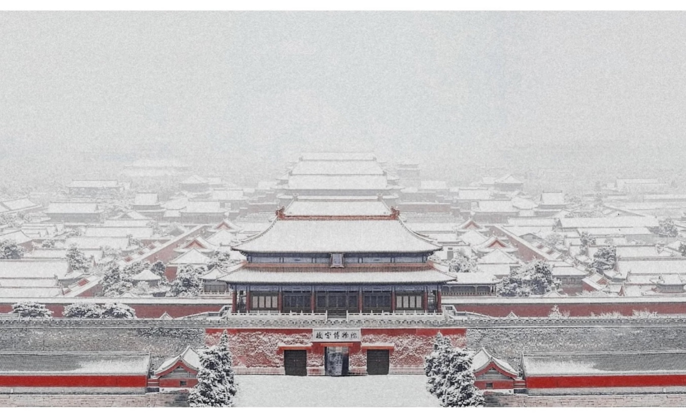

# 北京

> 朱墙寒酥落金檐，一城宫阙谪天仙。

---

## 北平雪

> 朱墙寒酥落金檐，一城宫阙谪天仙。
> 步履微醺千秋雪，远赴人间盛世颜。

———癸卯年·冬·魏书

### 赏析

《北平雪》是一首充满古典意蕴与现代审美的诗词，诗人魏东坡以雪为眼、以城为幕，在时空交叠中完成一次对古都冬韵的诗意重构。

**意象织锦：雪落皇城的视觉史诗**——首句「朱墙寒酥落金檐」如工笔重彩，以「朱」「金」二色构建紫禁城富丽底色，又以「寒酥」（雪的雅称）的素白点染其上，冷艳对比暗合白居易《问刘十九》"绿蚁新醅酒，红泥小火炉"的色彩辩证法。次句「谪天仙」化静为动，将飘雪喻为谪降尘寰的仙灵，既呼应诗仙李白《清平调》"若非群玉山头见，会向瑶台月下逢"的仙家气象，又传承苏轼《水调歌头》"不知天上宫阙，今夕是何年"天人对话的哲性升华。

**时空叠境：微醺步履里的千年对话**——第三句「步履微醺千秋雪」堪称诗眼，借酒意朦胧消弭时空界限：一个「醺」字暗藏苏轼《赤壁赋》"饮酒乐甚，扣舷而歌"的旷达，而「千秋雪」则化用诗圣杜甫《绝句》"窗含西岭千秋雪"的苍茫感。当现代人的醉眼与古代的雪光相遇，恰似张岱《湖心亭看雪》"天与云与山与水，上下一白"的空寂中，忽闻渺远更鼓。

**盛世隐喻：雪映山河的时代注脚**——末句「远赴人间盛世颜」跳出传统咏雪诗的隐逸格调，以「远赴」二字赋予飞雪主动的历史参与感。此处「盛世颜」可作三重解：表层指雪覆宫阙后呈现的纯净之美；中层喻指古都历经沧桑后的新生气象；深层则暗含对当代国运的礼赞。全诗炼字精准如"谪"、"酥"、"醺"，赋予画面神韵；意境营造上成功融合帝都的庄严厚重与瑞雪的清逸灵动。其文辞之美、气象之宏、意蕴之永，足可追步古人佳作，诚为吟咏帝京风雪的妙笔华章。

---

## 大栅栏

> 前门天街京城游，宫廷糕酥京御楼。
> 闲听戏子唱离恨，御膳铜锅桂花酒。

———癸卯年·夏·魏书

### 赏析

这首《大栅栏》以极简的笔触勾勒出一幅京华烟雨的市井风情画，在尺幅之间生动复现了前门大栅栏作为"帝都繁华眼，百年雅俗源"的非凡魅力。

首句"前门天街京城游"开篇即以"天街"冠之，赋予了前门大街崇高、尊贵的历史地位（本指京城中轴线上的御道），点明其非凡气象，瞬间将读者带入六百年的历史纵深。次句"宫廷糕酥京御楼"——"宫廷糕酥"佐以"京御楼"之名，点出皇家宴飨传统的遗留，赋予饮食行为以浓郁的皇家遗韵和文人诗意。

"闲听戏子唱离恨"直接指向大栅栏戏园林立的传统，点明了戏曲这一国粹艺术在此地的繁荣。"闲听"二字更显雅致从容，是古时文人士大夫的赏玩心态。皇家御膳、市井铜锅、文人雅酒三种不同阶层的文化符号熔铸一体，形成多维度的审美空间。

这首作品以举重若轻的笔法，字里行间流淌着对京华传统技艺之精绝、生活美学之讲究、文化积淀之深厚的由衷赞叹。当铜锅腾起的热气与桂花酒的清冽在诗句中交融，我们看到的不仅是旧时风月，更是一个民族在现代化进程中守护文化根脉的自觉。
