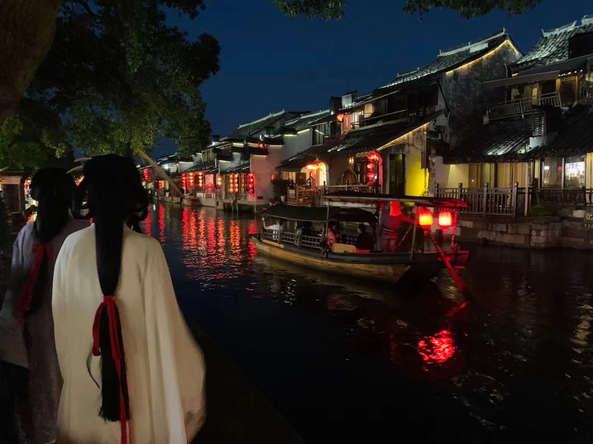
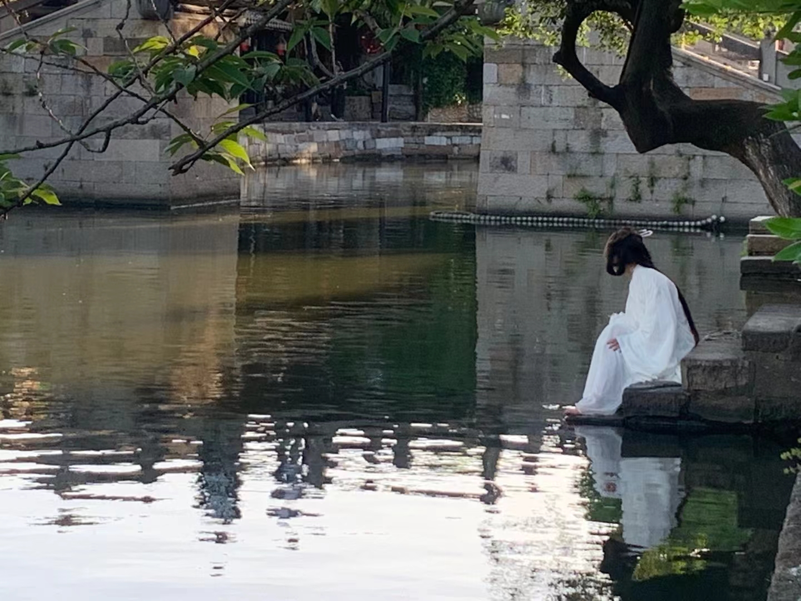

# 西塘

> 青砖黛瓦西塘径，小桥流水渡舟行。

---

## 江南古镇

> 西塘夜暮灯初上，银簪倩影照红妆。
> 烟雨长廊朝南埭，满船星河醉仙坊。

———甲辰年·夏·魏书

### 赏析

此诗以精炼典雅之笔，生动描绘了江南水乡传统美学。

"西塘夜暮灯初上"——"暮灯初上"四个字就把黄昏到入夜的过程写活了，让人想起"月上柳梢头"的古典意境，瞬间渲染出古镇灯火阑珊的序幕。

"银簪倩影照红妆"巧妙地化用了苏轼"故烧高烛照红妆"，灯火映照下女子发簪的银辉与红妆的倩影倒映水中，营造出一种精致、含蓄、旖旎的情调，充满了东方婉约之美。

"烟雨长廊朝南埭"——"烟雨"是江南的永恒意象，也是历代诗人词家吟咏的经典元素（如"多少楼台烟雨中"、"山色空蒙雨亦奇"）。

"满船星河醉仙坊"——此句想象瑰丽，意境升华。"满船星河"堪称神来之笔，将停泊在河中的船只所倒映的灯光、星光、甚或是人们放下的河灯描绘成一片流淌在船边的璀璨星河。这既是对古典诗词中"星河"意象（如"醉后不知天在水，满船清梦压星河"）的绝妙化用，又契合了水乡夜景光影交融的特色。

通过对"夜暮灯河"、"簪影红妆"、"烟雨长廊"、"船映星河"的精炼描绘，全诗充满了视觉的动感、色彩的冷暖（暖光、银辉、红妆、烟雨青墨、星河璀璨）和空间的层次，深得中国传统绘画散点透视与虚实相生之妙。

---

## 江南水乡

> 青砖黛瓦西塘径，小桥流水渡舟行。
> 莫作江南不归客，垆边若雪惊鸿影。

———甲辰年·夏·魏书

### 赏析

《江南水乡》以水墨点染之法，在四句间勾勒出江南灵韵的永恒胎动。

首句"青砖黛瓦西塘径"："青砖黛瓦"是江南古建筑最典型的色彩组合，立刻奠定了古朴、素雅的基调，勾勒出水乡的建筑轮廓。一个"径"字带出蜿蜒曲折的青石板路，引人步入画中。

次句"小桥流水渡舟行"将动态美学推至化境。石桥拱影暗合《考工记》"匠人营国"的几何智慧，舟楫划开的水痕恰是张旭狂草中的飞白笔势。渡舟载着的不仅是行人，更是韦庄"画船听雨眠"的唐风遗韵。

转句"莫作江南不归客"照见江南文化中「归与隐」的永恒命题。此句叩击着中国文人千年归去来兮的辩证漩涡，这声"莫作"既是白居易"能不忆江南"的千年回响，直指陶渊明"误落尘网中"的现代困境。

结句"垆边若雪惊鸿影"堪称点睛妙笔。垆边酒旗既是对卓文君当垆典故的化用，又暗藏杜牧"春风十里扬州路"的绮丽想象；"惊鸿影"非止于曹植洛神赋的形貌描摹，更似徐渭大写意中的墨韵留白——那惊鸿一瞥的刹那，实为吴门画派笔下永恒的刹那芳华。
