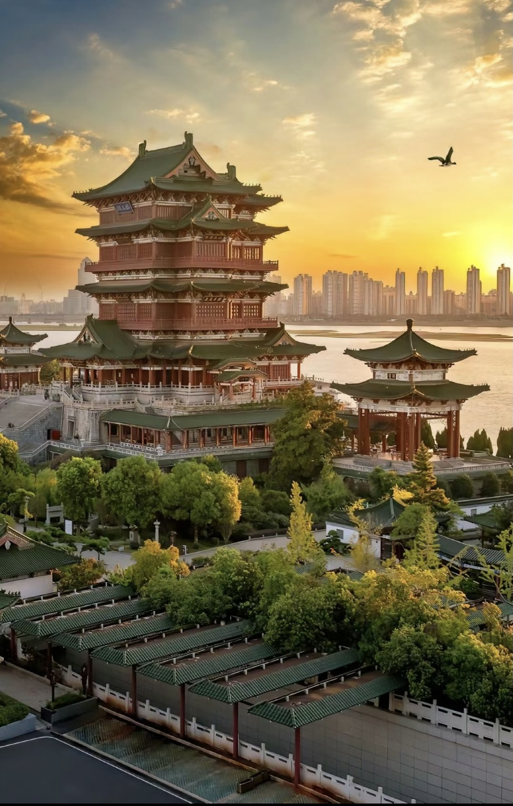

# 其他城市

> 千古圣贤皆过客，满天星河落人间。

---

## 谪仙人·长安（西安）

> 对酒当歌金樽浅，明月独酌醺谪仙。
> 千古圣贤皆过客，满天星河落人间。

———辛丑年·秋·魏书

### 赏析

魏东坡此作以李白风骨为魂魄，以浩瀚星河为笔墨，在四句二十八言间完成了一场跨越千年的精神对话。

开篇"对酒当歌金樽浅"用典精妙，将曹操《短歌行》的慷慨与李白《将进酒》的狂放熔铸一体。"金樽浅"三字别具匠心，既暗示宴饮未酣的余韵，又暗藏"酒樽虽小容天地"的哲学意趣。"明月独酌"以孤绝姿态突破传统对饮意象，月光浸透的杯影里，一个超脱时空的诗人形象跃然而出。

"千古圣贤皆过客"如惊雷破空，将个体生命置于历史长河审视。看似否定实则超越，以"过客"意象解构传统圣贤崇拜，又在解构中建构起诗性永恒的价值体系。这种对永恒的重新定义，既暗合李白"古来圣贤皆寂寞"的孤傲，又以更宏大的宇宙视角将个体生命提升至与星河对话的高度。

末句"满天星河落人间"堪称神来之笔，星河倾泻的壮美意象，既是对杜甫"星垂平野阔"的空间突破，又暗含苏轼"把酒问青天"的宇宙意识，以"落人间"三字道尽诗人眷恋人世、超而不遁的入世情怀。

诗中塑造的谪仙形象，既保持了传统文人"举杯邀月"的浪漫，又通过"星河落人间"的壮阔意象实现精神升华。此诗以有限的文字构建出无限的审美空间，既是对李太白诗魂的深情致意，更是对中华诗学精神的创造性传承。

---

## 太原行（太原）

> 晋阳故都汾河酒，暮色酩酊风满袖。
> 醉里浮云望归路，人间烟火古城楼。

———壬寅年·夏·魏书

### 赏析

"晋阳故都汾河酒"——开篇即以地理符号"晋阳"（太原古称）与"汾酒"点明地域文化基因，将千年古城的历史厚重与山西名酿的酣畅融为一体，暗合李白"兰陵美酒郁金香"的物华意象，却又赋予三晋特有的苍茫底色。

"暮色酩酊风满袖"——通过"酩酊"与"风满袖"的感官叠加，构建疏狂落拓的谪仙意象。风灌衣袖的疏阔，令人联想苏轼"一蓑烟雨任平生"的旷达，而暮色中的醉态又透出几分阮籍式的孤寂，形成外放内敛的情感复调。

"醉里浮云望归路"——浮云飘渺喻人生行迹无定，"归路"二字则暗藏羁旅愁思。此句化用李白"浮云游子意"的飘零感，却以醉眼朦胧消解沉重，在朦胧中达成物我两忘的禅境，深具王维"行到水穷处，坐看云起时"的淡然哲思。

"人间烟火古城楼"——"人间烟火"既呼应首句"故都"，又以温暖市井气冲淡浮云归路的苍凉，形成情感闭环，余味如汾酒回甘。青砖古垒承载岁月，市井炊烟升腾生机。此间烟火非仅实指炊烟，更隐喻生生不息的世俗温情。在"浮云"与"烟火"的意象对仗中，延续了杜甫"感时花溅泪"的深沉，又注入现代人对历史痕迹的温情凝视。

---

## 登滕王阁（南昌）

> 书生意气觅封侯，指点江山几度秋。
> 把酒临风今何在？万古长江空自流。

———丙申年·秋·魏书

### 赏析

魏东坡此作以滕王高阁为诗筏，以长江万古为墨池，简净笔触勾勒出登临怀古的苍茫意境，融个人襟抱与历史兴衰于一炉，在二十八字间完成了一场与王勃、李白的超时空对话。

首句"书生意气觅封侯"如金石裂帛，化用李贺"若个书生万户侯"的诘问，勾勒出传统文人的形象与抱负。"指点江山几度秋"以"指点"重构历史时空，将"觅封侯"的入世热望与"几度秋"的岁月流逝并置，形成理想与时间的初次碰撞。

转句"把酒临风今何在"如惊雷破空，"今何在"三字以天问姿态刺穿《滕王阁序》的华彩辞章，将个体存在抛入浩瀚时空——昔年宴饮的朱衣客、挥毫的王子安、醉月的李太白，皆在江风浩荡中化作齑粉。

结句"万古长江空自流"如暮鼓收韵，豪迈近苏轼"大江东去，浪淘尽，千古风流人物"，以大江永恒反衬功业空幻。"空自流"三字更具冷峭质感，在"自流"的从容中窥见庄子"天籁"的至境，令全诗在空阔中收束余响。

全诗贯穿着中国文人"入世-超脱"的精神张力，当"觅封侯"的锐气遭遇"空自流"的顿悟，当"指点江山"的豪情碰撞"万古长江"的苍茫，便织就一幅贯古通今的精神画卷。千年滕王阁所沉淀的历史回响与生命思考，更是对在历史长河与宇宙永恒前，那曾经热烈存在过的人文精神与个体生命的一曲深情挽歌。

---

## 鹧鸪天·洛阳怀古（洛阳）

> 断剑折戟沉沙中，残阳如血落苍穹。
> 将士埋骨荒草地，死后功名皆成空。
>
> 帝王术，古今同，烽火干戈图争雄。
> 只道君临天下梦，谁祭月下青衣冢？

———丙申年·秋·魏书

### 赏析

全诗以苍劲悲凉的笔触勾画历史烽烟，在古典词学的框架下展现出深厚的批判意识与人文情怀。

反战思辨——"断剑折戟沉沙中""将士埋骨荒草地"以冷兵器残骸与无名尸骨为意象，直指战争对生命的吞噬。将士"死后功名皆成空"的喟叹，与辛弃疾"了却君王天下事，赢得生前身后名。可怜白发生！"形成互文，但更强调功名的虚妄性，深化了反战主题。

批判权力本质——"帝王术，古今同"六字如史笔，揭破历代统治者"烽火干戈图争雄"的权谋本质，直刺权力游戏的循环宿命。

"青衣冢"这一独创意象尤具震撼力：区别于帝王陵寝的"冕旒冢"，"青衣"代指平民将士，其荒冢独对冷月，直指历史叙事中庶民话语的缺失。末句"谁祭月下青衣冢"以问叩天，较之陈陶"可怜无定河边骨"更添孤愤之气。

上片解构英雄史观（功名成空），下片解构帝王神话（权术循环），最终以"青衣冢"为无名者立碑。此与姜夔"今何许？凭阑怀古，残柳参差舞"的苍茫感相通，但更具平民视角的批判性。昔年东坡酹江月以吊英魂，今朝青衣冢独对千秋，两般境界，一种悲怀。

---

## 武侯祠（成都）

> 身蕴天地棋，心怀宇内计。
> 纶巾笑谈间，野火烧赤壁。

### 赏析

此诗以极简笔墨勾勒诸葛亮的神采气度。"身蕴天地棋"写其胸中丘壑，以天下为棋局；"心怀宇内计"写其匡扶汉室之志。"纶巾笑谈间"以苏东坡"羽扇纶巾，谈笑间樯橹灰飞烟灭"笔法，再现孔明从容自若的儒将风范。末句"野火烧赤壁"以自然意象暗喻战争烈度，含蓄深沉，余韵悠长。

---

## 登越王楼（绵阳）

> 桂花酒酿沁云酥，明月独倚凤栖梧。
> 灯火阑珊伊人影，落墨诗卷几分孤。

———庚子年·秋·魏书

### 赏析

魏东坡此作以故乡绵阳越王楼为砚，以秋夜孤光为墨，在二十八字间勾勒出一卷浸润桂香与月色的人文长轴。

"桂花"是中秋佳节的传统象征，承载着思乡怀远之意。"酒酿"与"沁云酥"结合，既写出了酒的醇香绵长，又以"云酥"一词赋予其轻盈飘渺的质感，仿佛酒香融入云端月色，极为风雅别致，有通感之妙。

"明月"是古典诗词永恒的母题，象征澄澈、团圆或孤寂。"凤栖梧"典出《诗经·大雅·卷阿》"凤凰鸣矣，于彼高冈。梧桐生矣，于彼朝阳。"梧桐是高贵祥瑞之树，凤凰非梧桐不栖。明月"独倚"凤栖之梧，既勾勒出清冷高远的画面，更暗喻了登临之地（越王楼）的高雅与历史厚重感，同时"独"字奠定了全诗的孤清基调，以高贵之物衬孤寂之情，意境倍增。

"灯火阑珊"化用辛弃疾"蓦然回首，那人却在，灯火阑珊处"。此处点出秋夜将尽，灯火稀疏之境。"落墨"是文人雅士日常，"诗卷"承载其心志。在月色梧影、阑珊灯火与人影的背景下，诗人伏案书写，最终感受到的是"几分孤"——这不仅指外在环境的冷清，更指向文人内心深处难以排遣的孤高情怀或对知音难觅的感喟。

全诗不着一个直接抒情的字眼，然情思无处不在。典故如盐入水，了无痕迹，增添了诗词的文化底蕴和深沉意味。整体格调高华，境界清远超迈。

---

## 海南·致定风波（儋州）

> 谪居儋州撷菜荒，翰墨丹青载酒堂。
> 隐入尘烟不归客，此心安处是吾乡。

———壬寅年·冬·魏书

### 赏析

诗中"谪居儋州撷菜荒"，引用典故"问汝平生功绩，黄州惠州儋州"。北宋绍圣四年，苏轼因党争再贬海南，彼时儋州荒僻瘴疠，生活艰苦，苏轼却开荒种菜、采药著述，以"撷菜""载酒"化苦难为诗意。此句以"菜荒"暗喻生存之艰，又以"撷"字赋予主动接纳的从容，凸显士大夫于逆境中自力更生的坚韧。

"翰墨丹青载酒堂"浓缩苏轼在海南的文化贡献。"载酒堂"是苏轼讲学之所，他在此传播中原文化，收黎族学子为徒，以诗书翰墨滋养蛮荒之地。

"隐入尘烟不归客"以"尘烟"喻指世俗纷扰与人生漂泊，而"不归客"暗含苏轼决意扎根海南、超越政治浮沉的态度。此句化用陶渊明"归去来兮"的隐逸意象，却更进一步：非避世而逃，乃主动融入民间。

"此心安处是吾乡"直接引用苏轼《定风波·南海归赠王定国侍人寓娘》名句，亦是全诗精神内核。苏轼在海南作《别海南黎民表》云："我本海南民，寄生西蜀州"，以他乡为故乡的豁达，打破地理疆界与身份执念。此句将儒家"安贫乐道"与禅宗"心外无物"交融，成就古典士大夫"无处不家园"的至高境界。

---

## 东钱湖（宁波）

> 东钱湖畔雾生烟，柔波寻岸雨漪涟。
> 儒生不羡匹夫勇，江山社稷笑谈间。

———壬辰年·夏·魏书

### 赏析

此诗以宁波东钱湖为背景，前两句写景——"雾生烟"、"柔波寻岸"、"雨漪涟"勾勒出湖光山色的朦胧美。后两句转写情怀——"儒生不羡匹夫勇"表达了文人以智谋报国的胸襟，"江山社稷笑谈间"颇有诸葛亮"隆中对"、周瑜"羽扇纶巾，谈笑间樯橹灰飞烟灭"的气度。
