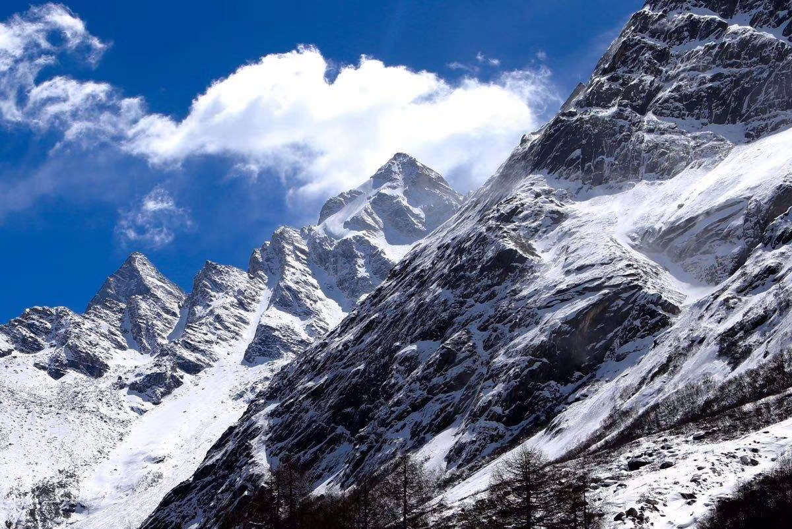

# 咏史怀古

> 千古兴亡多少恨，大江东去旧衣冠。

---

## 西楚霸王

> 巨鹿沉舟破秦关，鸿门惊宴剑舞寒。
> 屠戮咸阳焚三月，睢水鸿沟分楚汉。
> 垓下败逃骓不逝，霸王别姬泪潸然。
> 千古兴亡多少恨，大江东去旧衣冠。

———甲辰年·夏·魏书

### 赏析

全诗贯穿项羽生平关键节点：巨鹿之战（"巨鹿沉舟破秦关"）"沉舟"化用"破釜沉舟"典故；鸿门宴（"鸿门惊宴剑舞寒"）"剑舞寒"三字浓缩范增设计诛杀刘邦未果的凶险；火烧咸阳（"屠戮咸阳焚三月"）直指其暴行失民心；楚汉相争（"睢水鸿沟分楚汉"）以"鸿沟"喻战略转折。

从巨鹿（前207年）至垓下（前202年），以五年霸业兴衰为经，以地理位移为纬，构建出史诗级时空框架，效法杜甫《咏怀古迹》的"以地系史"手法，气象恢宏。

"骓不逝"直引项羽《垓下歌》原句，借战马踟蹰喻英雄末路；"泪潸然"与"剑舞寒"形成刚柔对照：前者写别姬之柔肠，后者写宴席之杀机，凸显项羽性格的矛盾性——勇武盖世却优柔寡断。

尾联"千古兴亡多少恨"跳出杜牧"卷土重来未可知"的假设，亦未取李清照"不肯过江东"的礼赞，而是以"恨"字统摄全篇——既含项羽之遗恨，亦寓历史兴废之共恨。"旧衣冠"暗藏诗眼：项羽之死象征先秦贵族精神的消亡。其宁死不渡乌江，恰如孔子"君子死而冠不免"的气节。此诗不仅咏项羽，更为"重义轻生"的古典英雄精神立碑。

---

## 沁园春·雪

> 雪舞苍山，漫地银霜，枯木寂寥。望苍穹深处，似隐天道。雾霭缭绕，踏破初晓。满腹经纶，尝尽苦寒，欲与天公试比高。凌云志，誓要登临道，俯瞰九霄。
>
> 千古风流人物，湮灭青史难争今朝。叹屈平忧柔，空赋离骚，霸王无谋，垓下兵逃。孟德自恃，乱世枭雄，铜雀未能锁二乔。皆成空，归来众山小，风华正茂。

———丙申年·冬·魏书

### 赏析

**自然意象的雄浑之美**——"雪舞苍山，漫地银霜"以泼墨式笔法勾勒出冰雪覆盖的苍茫山野，与古典山水画中"寒林雪霁"的意境相通。"枯木寂寥"暗含《庄子·齐物论》"形固可使如槁木"的哲学意象，喻示冬藏待发的自然轮回。

**天道意象的玄妙哲思**——"望苍穹深处，似隐天道"将视觉升华为宇宙追问，效法屈原《天问》对浩渺天道的探索。雾霭缭绕中"踏破初晓"的动态描写，暗合《周易·乾卦》"终日乾乾，与时偕行"的进取精神。

**对历史悲剧的深度反思**——下阕以"屈平忧柔""霸王无谋""孟德自恃"为典型，揭示传统英雄的局限：屈原忠而见弃，空留《离骚》悲鸣；项羽刚愎失策，垓下之败成兵家反鉴；曹操虽为枭雄，"铜雀春深"终成虚妄。

"欲与天公试比高"的磅礴气概，直承毛泽东原词中"欲与天公试比高"的挑战意识，而"誓要登临道"进一步将"天道"从敬畏对象转化为攀登目标，体现《孟子》"上下与天地同流"的儒家担当。全词以"凌云志"起笔，以"风华正茂"收束，将"修身齐家治国平天下"的儒家理想，熔铸于冰雪淬炼的刚健气质中。

---

## 念奴娇

> 亘古冰峰，耸千丈，苍山岿然不动。白雪皑皑，望眼处，北麓横卧苍穹。经天纬地，斗转星移，览乾坤无穷。独立寒巅，流尽岁月峥嵘。
>
> 青史笔墨厚重，留无数英雄，江山如梦。勾践藏锋，笠泽战，铁蹄踏破长空。汉祖平庸，屈身赴鸿门，意气江东。诗酒临风，凌云其乐无穷。

———戊戌年·冬·魏书

### 赏析

上阕以西部雪山为原型，以"亘古冰峰""白雪皑皑"突出"岿然不动"的静态永恒感。"经天纬地，斗转星移"暗合《周易》宇宙观。"独立寒巅"化用毛主席"独立寒秋"的孤绝，而"流尽岁月峥嵘"则以拟人手法凝缩历史长河，呼应苏轼"大江东去，浪淘尽千古风流人物"的沧桑感。

下阕突破"成王败寇"史观：勾践的隐忍（藏锋）与项羽的桀骜（意气）并置，暗示英雄精神的多元性。末句"诗酒临风，凌云其乐无穷"以李白式的飘逸收束全篇，其"乐"非俗世欢愉，而是勘破历史兴亡后与天地共适的旷达，直追苏轼"一尊还酹江月"的宇宙意识。

此词深得宋人神髓而更具现代性：继承苏轼"大江东去"的历史苍茫、辛弃疾"气吞万里"的英雄气概，打破"怀古必伤今"的窠臼，以"凌云其乐无穷"将个体生命安顿于永恒自然，为传统词境注入现代生命哲学。

---

## 临江仙

> 落樱成雪暮春游，碑文悼墨若孤。叹千古风流人物。昔时流觞词，今朝皆尘土。
>
> 名垂青史英雄梦，雄心豪迈如初。望苍茫山峦隐路。他日凌绝顶，主天地沉浮。

———丙申年·春·魏书

### 赏析

《临江仙》一词以落樱为引、碑文为镜，在暮春的绚烂与寂灭间叩问存在本质，展开一场横跨千年的精神远征。

上阕"落樱成雪"以物哀美学开篇，落花如雪暮春之实景引发生命短暂、繁华易逝之叹。"叹千古风流人物"巧妙化用苏轼"大江东去，浪淘尽，千古风流人物"，将读者瞬间带入历史长河的语境。"昔时流觞词，今朝皆尘土"此处用《兰亭集序》"曲水流觞"的著名典故，描绘昔日文人雅集、诗酒风流的盛况，与"皆尘土"形成强烈对比，深刻体现了古典诗词中对时间流逝与世事无常的哲思。

下阕"名垂青史英雄梦，雄心豪迈如初"，词人并未沉溺于怀古的伤感与虚无，而是从历史人物、前贤身上汲取力量，体现了中国士大夫"明知不可为而为之"、"天行健，君子以自强不息"的积极进取精神。

"他日凌绝顶，主天地沉浮"结尾两句气魄非凡，直引杜甫"会当凌绝顶，一览众山小"的诗意，表达登顶的志向，气势磅礴。全词融合了儒家进取（名垂青史、主天地沉浮）、道家超越（凌绝顶、观苍茫）以及对生命价值的深刻体悟，完美地继承了苏辛豪放词以来的雄浑气魄与深沉哲思。

---

## 少年游

> 伫立圣山仰天道，一代天骄身寂寥。
> 千古英雄俱往矣，风流人物看今朝。

———癸卯年·夏·魏书

### 赏析

"伫立圣山仰天道"开篇起势苍茫，"圣山"在传统诗词里常象征崇高理想，"伫立"显其凝思沉郁，"仰天道"则心怀敬畏，追问苍穹。此句直追屈子《天问》与陈子昂《登幽州台歌》的苍茫气象。

"一代天骄身寂寥"将目光投向历史长河中的至高英雄，"一代天骄"用成吉思汗典故，"身寂寥"三字力透纸背，道出英雄身处巅峰时的孤绝之境与辉煌背后的空寂感伤。

"千古英雄俱往矣"此句笔锋陡然荡开，气象宏大，其气魄与沧桑感直逼苏轼"大江东去，浪淘尽，千古风流人物"以及辛弃疾"千古兴亡多少事？悠悠。不尽长江滚滚流"。

"风流人物看今朝"承千古之叹后，诗意陡然转折，落脚于"今朝"。这是全诗的"诗眼"，亦是精神之升华。末句"风流人物看今朝"之气势与立意，清晰可见对毛泽东《沁园春·雪》中"数风流人物，还看今朝"的巧妙化用与致敬。

全诗以雄浑苍茫的意境起兴，诗由仰观天道，到对历史英雄充满深沉的悲悯与喟叹，再到纵览千古英雄，最终以无比豪迈的气概收束于对当世"风流人物"的激赏，一气呵成，酣畅淋漓。
